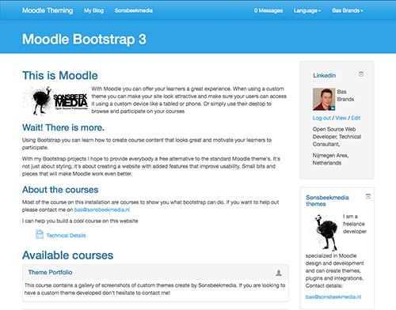

About this theme
================

This is the SmartsBridge theme for Moodle.

* package   Moodle SmartsBridge theme
* copyright 2015 John Welch. welchitconsulting.com
* authors   John Welch
* license   http://www.gnu.org/copyleft/gpl.html GNU GPL v3 or later

This theme is based on the Twitter Bootstrap CSS framework version 3.3.2.
It contains all unmodified less* CSS sources from the Twitter Bootstrap CSS
framework.
On top of the Bootstrap less CSS sources Moodle CSS is added to create this
theme.

HTML5 is tags are used in the /layout/general.php file. The structure of this file
provides a 2-1-3 layout when looking at your Moodle page source. This improves
accessibility and Search Engine Optimization (SEO).

*less CSS
Less CSS is a Object Oriented way of writing CSS code. All Less CSS files
for this theme are stored in the /less folder. A developer can use recess
to generate the CSS files in the /style folder. For more
information read /less/README

JavaScript Libraries

html5shiv.js
------------
To provide backwards compatibility for HTML5 for Internet Explorer 7 (IE7) and Internet
Explorer 8 (IE8) a javascript library call /javascript/html5shiv.js was added. This
JavaScript converts HTML tags and CSS into Tag that are understood by IE7 and IE8.
The config.php makes sure these libraries are only loaded for IE7 and IE8.

bootstrap.js
--------------------------------------------------------------
This is the Bootstrap JavaScript file created by @fat and @mdo

Licenses & Authors
==================

Twitter Bootstrap Copyright and license
---------------------------------------
Authors: Mark Otto, Jacob Thornton
URL: http://twitter.github.com/bootstrap/
License:

Copyright 2012 Twitter, Inc.

Licensed under the Apache License, Version 2.0 (the "License");
you may not use this work except in compliance with the License.
You may obtain a copy of the License in the LICENSE file, or at:

   http://www.apache.org/licenses/LICENSE-2.0

Unless required by applicable law or agreed to in writing, software
distributed under the License is distributed on an "AS IS" BASIS,
WITHOUT WARRANTIES OR CONDITIONS OF ANY KIND, either express or implied.
See the License for the specific language governing permissions and
limitations under the License.

Html5shiv.js
------------
Author: Sjoerd Visscher
URL: http://en.wikipedia.org/wiki/HTML5_Shiv, https://github.com/aFarkas/html5shiv
License: MIT/GPL2 Licensedc
